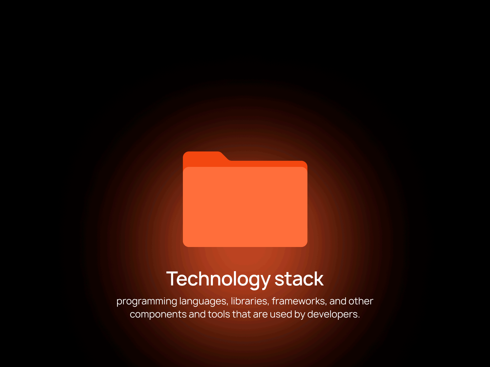

<!-- I'm Jyoti ```verified```-->
<h2>&nbsp;Hi I'm <a href="https://jyoti-1665.github.io/" target="_blank">Jyoti</a>
</h2>

<!-- Aspiring Data Analyst -->


<!-- Jyoti -->


 <!-- Github Buttons -->
  <a href="https://github.com/Jyoti-1665">
    
  </a>
 <a href="https://www.linkedin.com/in/ijyoti-bansal/">
  </a>

<!-- Typing Animation -->
[](https://git.io/typing-svg)

<!-- 👤 About Me -->


- *🌱 A passionate learner and aspiring Data Analyst & Data Engineer*
- *📊 Experienced with Power BI, Excel VBA, SQL, and Python*
- *🎯 Currently working on real-world projects to build strong hands-on skills*
- *📅 Career goal: Join a top IT company in India (Aug–Sept 2025)*

<!-- ## 🚀 My Mission  -->


- *To simplify complex data for easy interpretation.*
- *To fulfill my dream of becoming a proficient Data Analyst.*
- *To create professional and automated reporting systems.*
- *To continuously learn and apply new data technologies.*
- *To contribute to data-driven decision making in organizations.*

<!-- ## 💻 Skills & Expertise -->


<!--  -->
<!--  -->
<!--  -->
<!--  -->
<!--  -->
<!--  -->
<!--  -->
<!--  -->
<!--  -->
<!-- -->
<!--  -->
<!--  -->
<!--  -->
<!--  -->
<!--  -->
<!--  -->
<!--  -->
<!--  -->
<!--  -->
<!--  -->
<!--  -->


<!-- ## ⚙️ Tech Stack -->
***Tech Stack***

<!-- Skill buttons -->
<p align="center"> 
  
  
  
  
  
  
  
  
  
  
  
  
  
  
  
  
  
  
  
  
  
  
  
  <!--  -->
  <!--  -->
  <!--  --> 
  <!--  -->
  <!--  -->
  <!--  -->
  <!--  -->
  <!--  -->
  <!--  -->
  <!--  -->
  <!--  -->
  <!--  -->
  <!--  -->
  <!--   --> 
</p>

 <!-- ## 📚 Currently Learning -->
 ***Currently Learning***
 
- *Data Engineering tools (ETL, pipelines, big data)*
- *Advanced Power BI dashboards*
- *GitHub project workflow*

<!-- ## 📂 Featured Projects -->
***Projects***

*Showcasing my practical experience across data and technology tools — from cleaning and transforming data to creating insightful visualizations.*
*Each project reflects my ability to turn raw information into meaningful, business-ready insights.*

<!-- Card Style Repositories -->

<!-- Vendor-Performance-Analysis -->
[](https://github.com/Jyoti-1665/Vendor-Performance-Analysis)

<!-- Hotel_data -->
[](https://github.com/Jyoti-1665/Hotel_data)

<!-- sales-data-analysis -->
[](https://github.com/Jyoti-1665/sales-data-analysis)

<!-- Food-Delivery-Dashboard -->
[](https://github.com/Jyoti-1665/Food-Delivery-Dashboard)

<!-- Mobile-Dashboard -->
[](https://github.com/Jyoti-1665/Mobile-DASH.)

<!-- Excel-sales-Dashboard -->
[](https://github.com/Jyoti-1665/Excel-sales-Dash.)

<!-- Couse_Analysis-Dashboard -->
[](https://github.com/Jyoti-1665/Couse_Analysis-Dash.)

<!-- Hospital-Analysis-Dashboard -->
[](https://github.com/Jyoti-1665/Hospital-Analysis-Dashboard)

<!-- Portfolio Website -->
[](https://github.com/Jyoti-1665/jyoti-1665.github.io)

<!-- GitHub Profile -->
[](https://github.com/Jyoti-1665/Jyoti-1665)

<!-- ## 💡 ##Tip: -->
🌟 *Each project embodies my commitment to transforming data and ideas into impactful outcomes — from dynamic data models and interactive dashboards to professional business presentations and insightful reports. These works reflect both technical precision and a deep understanding of business storytelling.*

<!-- ## 📬 Connect with Me -->


<!-- Typing Animation / 🤝 Connect with me -->
[](https://git.io/typing-svg)

<!-- Social Media Linkes -->
<div align="center">
 
[](https://www.linkedin.com/in/ijyoti-bansal/)
[](https://github.com/Jyoti-1665)
[](mailto:bansaljyoti154@gmail.com)
[](https://jyoti-1665.github.io/)
</div>

<!-- ## 🚀 GitHub Performance Overview -->
&nbsp;***GitHub Performance Overview***

<!--## 🏆 GitHub Trophies -->
&nbsp;***GitHub Trophies***
[](https://github.com/ryo-ma/github-profile-trophy)

<!-- ## 🧠 Contribution Pulse -->
&nbsp;***Contribution Pulse***

<!-- Contribution Pulse Buttons -->


<!-- ## 🧮 GitHub Metrics -->
&nbsp;***GitHub Metrics***
<p align="center">
  
</p>

<!-- ## 👨‍💻 Profile Summary Card --> 
&nbsp;***Profile Summary Card***


<!-- ## 📊 GitHub Stats -->
&nbsp;***GitHub Stats***


<!-- ## 💬 Top Languages -->
&nbsp;***Top Languages***


<!-- ## 🔝 Top Contributed Repositories-->
&nbsp;***Top Contributed Repositories***


<!--## 🔥 GitHub Streak -->
&nbsp;***GitHub Streak***


<!--## 📈 Activity Graph -->
&nbsp;***Activity Graph***


<!-- ## 🐍 Snake Contribution Animation -->
<!-- &nbsp;***Snake Contribution Animation*** 

<div align="center">
 

 
</div> -->

<br>
<!-- ⭐💫 Shower stars if you like my repos -->
<div align="center">

<a href="https://github.com/Jyoti-1665/Jyoti-1665" alt="GitHub Stars" title="Star my repositories">

</a>
</div>

<!-- Typing Animation / 🤝 Thanks for Visiting! -->
[](https://git.io/typing-svg)

<!-- ## 🤝 Contact me -->
<div align="center">
<!-- 💼 LinkedIn -->
<a href="https://www.linkedin.com/in/ijyoti-bansal/"></a>
<!-- 🆔 GitHub -->
<a href="https://github.com/Jyoti-1665" target="_blank">
  
</a>
<!-- 📮 Gmail -->
<a href="mailto:bansaljyoti154@gmail.com" target="_blank">

</a>
<!-- 🌐 Website -->
<a href="https://jyoti-1665.github.io/" target="_blank">
  
</a>
</div>
<br>

<!-- ⚠️ Disclaimer -->
⚠️*Disclaimer:**This repository is for educational use only. Feel free to fork or learn from it,
<br>but please avoid any commercial redistribution.*

<!-- The end of my GitHub profile -->
